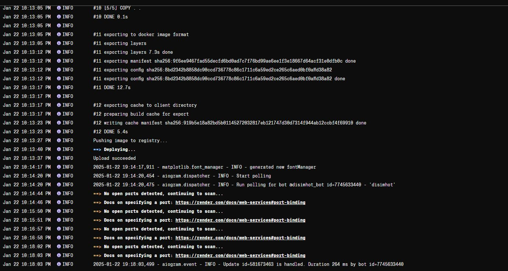
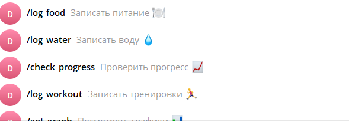
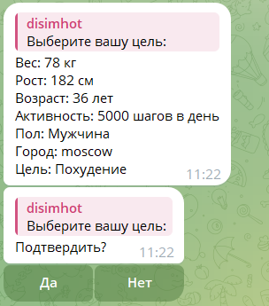
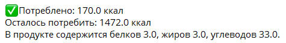
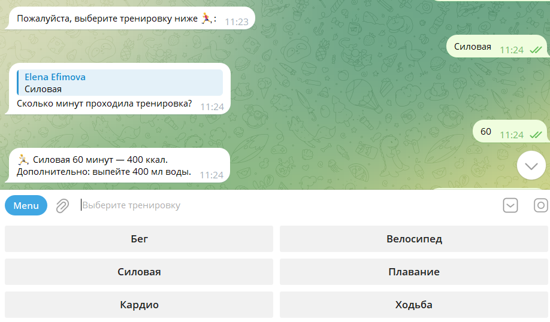
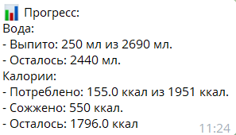
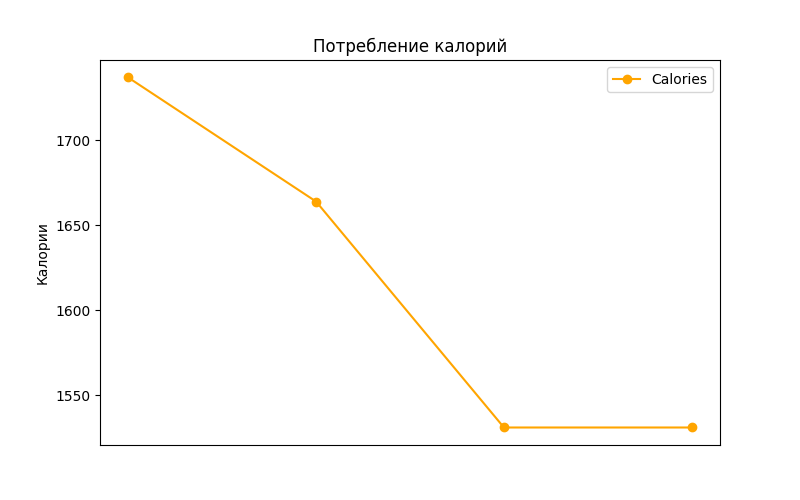
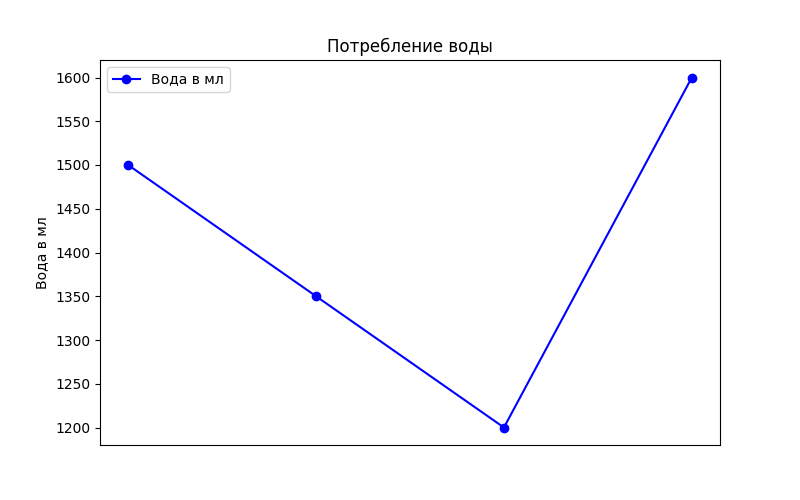

**Telegram-бот, который помогает пользователю рассчитать дневные нормы воды и калорий, а также отслеживать тренировки и питание.**

## Деплой выполнен на render.com

# Основные возможности

##### 1. /start

Пользователю будет предложено установить свой профиль.
Если id пользователя есть в БД, то ему покажется продвинутое меню со всеми командами.

##### 2. /set_profile

Ввод данных о весе, росте, поле, возрасте, активности и городе для расчёта норм воды и калорий.
После ввода данных пользователь может их подтвердить или ввести заново.

##### 3. /log_water
Пользователь вводит количество выпитой воды.

##### 4. /log_food
В проекте использована библиотека [FatSecret](https://platform.fatsecret.com/docs/v3/foods.search) для получения точных данных по калориям, но ее бесплатная версия работает только на английском языке.
Она работает с получением авторизационного токена и прописыванием ip address в настройках API библиотеки FatSecret.
Пользователь получает калории и соотношение нутриентов в продукте.

##### 5. /log_workout
Пользователю предлагается выбрать вид тренировки и ввести количество минут, которые он занимался.

##### 6. /check_progress
Пользователь проверяет свой прогресс по потреблению воды и калорий.

##### 7. /get_graph
Пользователь видит изменения по логированной еде и воде.

# Показ работы бота

